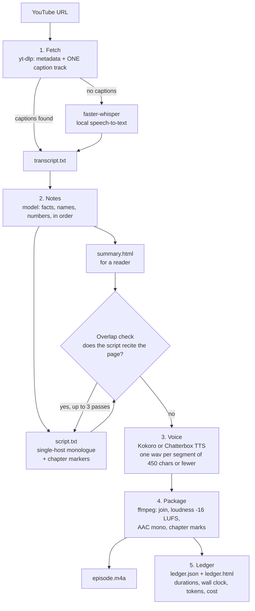

# yt-url-to-podcast

Turn one YouTube URL into two things: a written **HTML summary** for readers, and a **single-host audio episode** (`.m4a`) for listeners.

This repository exists to **demystify the URL-to-podcast workflow**. There is no hidden service. The whole pipeline is five small stages, a few command-line tools, and a language model that writes three texts. You can read every stage in under an hour.

> **Credits.** The original version of this project was developed by **Cursor with Grok 4.7 (high)**. Its orchestrator was packaged as an optional extension for the [Pi coding agent](https://www.npmjs.com/package/@earendil-works/pi-coding-agent). The core does not depend on Pi. A second run of the same procedure was then done by **Claude Code (Claude Sonnet 5.5)**, which read `skills/yt-podcast/SKILL.md` and followed it step by step. It also fixed a caption-track bug in `scripts/fetch_source.py` along the way.

## Hear the two episodes

Press play below. GitHub strips `<audio>` tags from a README, so each player is the same audio wrapped in a small video file (a still picture plus the sound).

**Run 1 — Cursor + Grok 4.7 (high):** Training Your Own Embedding Model Is Not As Hard As You Think (5m 18s)

<video src="https://github.com/user-attachments/assets/159e86d5-e4f5-416a-afed-ee61fb943b59" controls></video>

**Run 2 — Claude Code (Sonnet 5.5):** Anthropic Engineers Just 10x'd Everyone's Claude Code (5m 52s)

<video src="https://github.com/user-attachments/assets/d9106d60-564d-4214-8fa3-c6a0af6b51c4" controls></video>

The same episodes, with chapter marks, are on the project page and as direct files below.

**Player page (GitHub Pages):** <https://az9713.github.io/yt-url-to-podcast/>  ·  **Cost and timing ledger:** <https://az9713.github.io/yt-url-to-podcast/ledger.html>

| # | Built by | Source video | Episode file |
|---|---|---|---|
| 1 | Cursor + Grok 4.7 (high), via the Pi extension | [Training Your Own Embedding Model Is Not As Hard As You Think](https://www.youtube.com/watch?v=S7tFyREI19I) — Prompt Engineering, 12m 36s | [`episodes/S7tFyREI19I/episode.m4a`](https://az9713.github.io/yt-url-to-podcast/episodes/S7tFyREI19I/episode.m4a) · [summary](https://az9713.github.io/yt-url-to-podcast/episodes/S7tFyREI19I/summary.html) |
| 2 | Claude Code (Sonnet 5.5), following `SKILL.md` | [Anthropic Engineers Just 10x'd Everyone's Claude Code](https://www.youtube.com/watch?v=oz2CwrPV2Rg) — Nate Herk \| AI Automation, 12m 22s | [`episodes/oz2CwrPV2Rg/episode.m4a`](https://az9713.github.io/yt-url-to-podcast/episodes/oz2CwrPV2Rg/episode.m4a) · [summary](https://az9713.github.io/yt-url-to-podcast/episodes/oz2CwrPV2Rg/summary.html) |

The voices are synthetic. Each episode is a retelling, not the creator's words. The creators own the videos; watch the originals for the full content.

## The workflow



In plain words:

1. **Fetch.** `scripts/fetch_source.py` asks YouTube for the video's metadata and for **one** caption track. It prefers the speaker's own auto-caption track (`en-orig`) over a machine-translated one. If the video has no captions, it downloads the audio and `scripts/transcribe.py` transcribes it locally. That can take about as long as the video.
2. **Two texts, then a check.** The model writes `notes.txt` first. From the notes it writes `summary.html` (for reading) and `script.txt` (for listening). The script is written *without* looking at the page, so the episode does not simply read the page aloud. A small program (`src/overlap.ts`) flags any spoken sentence of 40 characters or more that matches a page sentence exactly or shares about 80 percent of its words. The script is rewritten, up to three passes, until none remain.
3. **Voice.** `scripts/speak.py` renders each segment of the script (450 characters or fewer) to a `.wav` file. A segment that already exists is skipped, so a stalled run can resume.
4. **Package.** `ffmpeg` joins the wavs, normalises loudness to about −16 LUFS, encodes mono AAC, and writes chapter marks taken from the script's `--- chapter: title ---` lines.
5. **Ledger.** One row per episode goes to `ledger.json`, and `ledger.html` is regenerated: video length, episode length, wall-clock time, model, token counts, cost. Unknown values stay `unknown`. Nothing is estimated from character counts.

## Two ways to run it

| | How | Who writes the three texts |
|---|---|---|
| **Pi extension** | `./scripts/podcast.sh <youtube-url>` or `/podcast <url>` inside Pi. The orchestration is TypeScript in `src/run.ts`; it calls the model through Pi for each stage, with checkpoints in `state.json`. | The model you select in Pi |
| **Any coding agent** | Give the agent `skills/yt-podcast/SKILL.md` and a URL. The agent runs the Python scripts itself and writes the texts itself. | The agent |

Both paths use the same scripts, the same file layout, and the same ledger.

## Tech stack and tools

| Layer | Tool | Job in the workflow |
|---|---|---|
| Agent runtime (optional) | [Pi coding agent](https://www.npmjs.com/package/@earendil-works/pi-coding-agent) (`@earendil-works/pi-ai`, `@earendil-works/pi-coding-agent`) | Hosts the `/podcast` command and the `--podcast` flag; sends prompts to the model |
| Orchestration | TypeScript on Node 22 (`--experimental-strip-types`, no build step) | `src/run.ts` stage runner, chunking, prompts, ledger, overlap check |
| Skill file | Markdown (`skills/yt-podcast/SKILL.md`) | The procedure, readable by any agent |
| Download | [yt-dlp](https://github.com/yt-dlp/yt-dlp) | Metadata, captions, and audio when needed |
| Speech to text | [faster-whisper](https://github.com/SYSTRAN/faster-whisper) (CPU, int8) | Only when a video has no captions |
| Text to speech | [Kokoro](https://github.com/hexgrad/kokoro) (`en`, `es`, `fr`, `hi`, `it`, `ja`, `pt`, `zh`); [Chatterbox](https://github.com/resemble-ai/chatterbox) (`ar`, `da`, `de`, `el`, `fi`, `he`, `ko`, `ms`, `nl`, `no`, `pl`, `ru`, `sv`, `sw`, `tr`) | Renders the script to speech. Other languages: HTML only |
| Audio | [ffmpeg](https://ffmpeg.org/) / ffprobe | Join, loudness (`loudnorm`), AAC, chapter marks |
| Python libs | `soundfile`, `numpy`, `misaki` | Audio files and phonemes for Kokoro |
| Tests | `node --test` | 13 tests for the pipeline and the ledger |

## Setup

You need Node 22.6 or later, Python 3.10 or later, `ffmpeg` and `ffprobe` on your `PATH`, and `yt-dlp` on your `PATH`. On Windows, Kokoro also needs [eSpeak NG](https://github.com/espeak-ng/espeak-ng) (`speak.py` looks in `C:\Program Files\eSpeak NG`).

```bash
python -m venv .venv
.venv/Scripts/python -m pip install -r requirements.txt   # Windows; use .venv/bin/python elsewhere
npm install -g @earendil-works/pi-coding-agent             # optional: only for the Pi front end
npm test
./scripts/podcast.sh "https://www.youtube.com/watch?v=VIDEO_ID"
```

`podcast.sh` uses `PI_MODEL=provider/model` when set. If only `OPENAI_API_KEY` is set, it uses `openai/gpt-4.1-mini`. Output goes to `episodes/<video-id>/`.

## What each run measured

Both runs used a video of about 12 minutes. The numbers come from `ledger.json`.

| Measure | Run 1: Cursor + Grok 4.7 (Pi) | Run 2: Claude Code (Sonnet 5.5) |
|---|---|---|
| Video length | 756 s (12m 36s) | 742 s (12m 22s) |
| Episode length | 317.8 s (5m 18s) | 351.9 s (5m 52s) |
| Episode / video | 42% | 47.4% |
| Transcript source | local faster-whisper (CPU) | YouTube auto-captions (`en-orig`) |
| Writing model | `openai/gpt-4.1-mini` through Pi | `claude-sonnet-5-5` |
| Voice | Kokoro `af_heart`, 19 segments | Kokoro `af_heart`, 20 segments |
| Script passes | 1 | 2 (pass 1 had 2 recited sentences) |
| Wall clock | 4,953 s (82m 33s) | 380 s (6m 20s) |
| Tokens | unknown (not saved at the time) | 2,584,992 cache-read + 34,331 cache-write + 48 uncached input + 15,416 output (1,653 of the output were thinking) |
| **Cost (USD)** | **unknown. Not recorded, and not estimated** | **about $0.76 at list price** (see Cost below) |

**Why run 1 took so long.** YouTube returned HTTP 429 after repeated caption requests, so the run transcribed the whole soundtrack on the CPU (about 15 minutes). Then one Kokoro segment stopped advancing for about 54 minutes before it was resumed. The procedure in `SKILL.md` is written to avoid both waits.

**Why run 2 took 6 minutes.** Captions were available and no voice segment stalled. Speech took 168 s for 351.9 s of audio (0.48 times real time).

**The caption bug.** Run 2 first got no captions either. The video has two English auto-caption tracks: `en` is a machine translation of the original, and YouTube answers it with HTTP 429. `en-orig` is the speaker's own track and downloads without error. `fetch_source.py` now tries `<lang>-orig` first.

## Cost of one conversion

| Run | Cost in USD | Basis |
|---|---|---|
| Run 1: Cursor + Grok 4.7 (Pi, `openai/gpt-4.1-mini`) | **Unknown** | The run ended before token counts were saved. No figure is given, because none was measured. |
| Run 2: Claude Code (Sonnet 5.5) | **About $0.76** | Token counts read from the session log for the 22 model calls between the first fetch and the finished `.m4a` (6m 20s), priced at list rates |

How the $0.76 is built. Rates are Sonnet 5.5 list prices per million tokens: cache read $0.20, 5-minute cache write $2.50, uncached input $2, output $10 (thinking tokens bill as output).

| Part | Tokens | USD |
|---|---|---|
| Cache reads | 2,584,992 | 0.517 |
| Cache writes (assumed 5-minute) | 34,331 | 0.086 |
| Uncached input | 48 | 0.000 |
| Output | 15,416 | 0.154 |
| **Total** | | **0.757** |

Read this number with care:
- **The rates are not from Anthropic's own pricing page.** I found them on third-party pages, and those pages disagree on earlier Sonnet 5 prices. Check [Anthropic pricing](https://platform.claude.com/docs/en/about-claude/pricing) before you rely on the figure.
- **Most of the cost is context re-reading.** Cache reads are 68% of the total. Each call re-read about 117,000 tokens of earlier conversation in a long session. A fresh session that only runs this procedure should cost less. I did not measure that.
- **It is a list-price equivalent.** If Claude Code runs on a subscription plan, the amount you actually pay for this conversion can be $0 extra.
- **Local compute is not counted.** yt-dlp, Kokoro (168 s of CPU time), ffmpeg, and electricity are free of API charges.
- **Log method.** The window has 22 unique model responses, found by message id. If the log merged any two responses, the true token count is higher.

## Repository layout

```
extensions/index.ts        Pi extension: /podcast command and --podcast flag
skills/yt-podcast/SKILL.md The procedure, readable by any agent
src/                       Stage runner, prompts, chunking, overlap check, ledger, metrics
scripts/                   fetch_source.py, transcribe.py, speak.py, podcast.sh, seed-ledger.ts
test/                      node --test suites
episodes/<video-id>/       notes, script, summary.html, episode.m4a for each run
ledger.html, ledger.json   One row per episode
index.html                 Player page for GitHub Pages
```

Large intermediate files (wav parts, raw audio, caption files, full transcripts) are not committed. See `.gitignore`.

## Known limits

- The episode is a *retelling*. The overlap check stops the script from reciting the page; it does not report which claims the script left out.
- Auto-captions misspell names. Neither run measured caption or transcription error against the soundtrack.
- Figures in a summary are the speaker's statements. The pipeline does not verify them against the sources the speaker cites.
- Token counts and cost are recorded only when the model response includes them.
